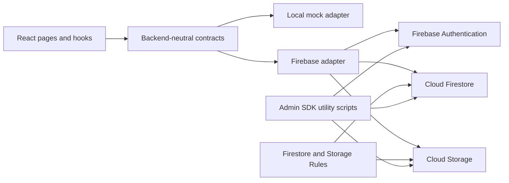

# Current architecture and service dependencies

## Classification

The repository does not contain a self-hosted application backend. There is no Python, Django,
FastAPI, Express, or other production server entry point. Vite is a development/build server, and
the Node scripts under `scripts/` are administrative utilities rather than a web API.

The application is therefore **React frontend + backend as a service**, not a completely standalone
frontend. In Firebase mode, the browser talks directly to Firebase Authentication, Cloud Firestore,
and Cloud Storage.

## Runtime providers

| Provider | Purpose | Network required | Admin access | Persistent writes |
| --- | --- | --- | --- | --- |
| `mock` | Local UI development with explicitly labelled demo content | No | Disabled | No; changes live only for the page session |
| `firebase` | Existing realtime production prototype | Yes | Google sign-in plus `admin: true` Custom Claim | Firestore and Storage |

Set `VITE_DATA_PROVIDER=mock` or `VITE_DATA_PROVIDER=firebase`. Development defaults to `mock` when
the variable is absent; production builds default to `firebase` so a deployment cannot silently
substitute demo content for missing cloud data. Firebase variables are validated only when the
Firebase adapter is selected.

## Service responsibility table

| Capability | Current implementation | Browser dependency | What stops if Firebase is removed without a replacement |
| --- | --- | --- | --- |
| Public projects | Firestore `projects`, public query | `firebase/firestore` | Gallery, project details, public making journal, review target list |
| Categories and visibility | Firestore `metadata/categories` and `metadata/hiddenCategories` | `firebase/firestore` | Admin category management and visibility synchronization |
| Progress | Embedded in each project document as `worksteps` and `completionPercent` | `firebase/firestore` | Public making journal and project progress editing |
| Reviews | Firestore `reviews` with pending/approved/rejected states | `firebase/firestore` | Visitor submissions, public approved reviews, moderation |
| Studio settings and craftspeople | Firestore metadata documents | `firebase/firestore` | Contact QR code, WeChat identifier, craftsperson contact details |
| Administrator identity | Firebase Authentication Google provider and ID-token Custom Claim | `firebase/auth` | Admin login, Claim verification, logout session |
| Media | Firebase Storage public object paths | `firebase/storage` | New image uploads, replacement, deletion and download URLs |
| Security enforcement | Firestore and Storage Rules | Firebase platform | Public/private read boundaries and all browser write authorization |
| Claim and legacy migration | `firebase-admin` scripts | Node utility only | Administrator provisioning and one-time Firebase migration |

## Coupling inventory

Firebase SDK imports are restricted to `src/services/firebase/` and the temporary
`src/services/backend/firebaseBackend.ts` adapter. Components and hooks use the contracts in
`src/services/backend/contracts.ts`.

Non-runtime Firebase assets remain intentionally present while migration is pending:

- `firebase.json`, `firestore.rules`, and `storage.rules`;
- `tests/rules/` emulator tests;
- `scripts/set-admin-claim.mjs` and `scripts/migrate-firebase-data.mjs`;
- Firebase packages in `package.json`;
- Firebase setup and migration documentation.

Deleting any of those now would remove the only working persistent backend or its security tests.
The future REST implementation should implement `StudioBackend`; UI components should not import a
Python API client directly.
